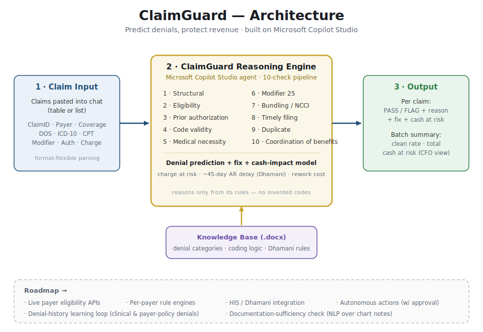

# ClaimGuard — Predict Denials, Protect Revenue

*An AI agent that scrubs medical claims **before** submission, predicts which will be denied and why, recommends the fix, and quantifies the cash at risk — built on Microsoft Copilot Studio.*

**Microsoft Agents League Hackathon · Enterprise Agents track**

---

## The problem

Denied claims are one of the largest sources of trapped revenue in healthcare. Most denials are preventable at submission — yet teams typically catch them only *after* the payer rejects the claim, weeks later, when the cash is already stuck in accounts receivable and rework has begun.

ClaimGuard moves that check to the front of the process. It reviews each claim before it ever leaves the door, predicts denials, and frames the impact the way a CFO thinks about it: **cash protected, not codes corrected.**

## What it does

ClaimGuard runs every claim through a **ten-step reasoning chain** and returns a plain-English verdict, a specific fix, and the financial impact:

1. **Structural** — required fields present
2. **Eligibility** — coverage active on the date of service
3. **Prior authorization** — required auth present for codes that need it
4. **Code validity** — valid, current CPT codes
5. **Medical necessity** — diagnosis supports the procedure
6. **Modifier** — modifier 25 present when an E/M is billed with a same-day procedure
7. **Bundling (NCCI)** — no unbundled component panels
8. **Timely filing** — within the payer's filing window
9. **Duplicate** — no duplicate submissions
10. **Coordination of benefits** — correct primary/secondary payer order

For every flagged claim it reports the **charge at risk**, the estimated **days stuck in AR** if denied, and the **rework cost avoided** — then totals the exposure across a batch and reports a first-pass clean rate.

## Architecture

Claims are provided in the conversation; the Copilot Studio agent applies its ten-check reasoning pipeline against a knowledge base of denial logic and returns plain-English verdicts with cash impact. The agent reasons only from its rules — it does not invent codes or payer policies.

## Demo

▶️ **Video walkthrough:** _[add your YouTube/Vimeo link here]_

The demo shows a clean claim passing, several claims flagged with full reasoning and fixes, a "negative control" (a routine-exam diagnosis correctly passing when paired with a *preventive* code — proving the agent reasons rather than pattern-matches), and a batch run with the CFO summary.

## How to reproduce

This is a low-code agent built in Microsoft Copilot Studio.

1. In Copilot Studio, create a new agent named **ClaimGuard**.
2. Paste the contents of [`agent-instructions.md`](agent-instructions.md) into the agent's **Instructions**.
3. (Optional) Add [`ClaimGuard_Denial_Reference.docx`](data/ClaimGuard_Denial_Reference.docx) as a **Knowledge** source for richer denial explanations.
4. Set the suggested prompts (see `agent-instructions.md`).
5. Open the **Test** pane, paste a claim batch (see [`data/`](data/)), and ask it to scrub the batch.

No live integrations are required — claims are provided in the conversation, so the agent runs entirely on synthetic data.

## Tech stack

- **Microsoft Copilot Studio** — agent authoring and reasoning
- **Microsoft 365** — host environment
- Synthetic claim datasets (`.xlsx`) and a denial-reference knowledge base (`.docx`)

## Data

All claim data in this repository is **synthetic**. There is **no real patient information (no PHI)**. Procedure and diagnosis codes are referenced **illustratively only** — this repo contains no proprietary code lists. Any specific code should be validated against a current code set before production use.

Two datasets are included in [`data/`](data/):
- A 13-claim batch and a 16-claim batch, each with an answer key for validation.

## Security & compliance

- **No secrets** — this repository contains no API keys, tokens, tenant IDs, or connection strings.
- **No PHI** — all data is synthetic; no real patient, provider, or payer records.
- **Intended production auth** — a production deployment would use Copilot Studio's "Authenticate with Microsoft" so only authorized revenue-cycle staff could access the agent.
- **Data protection** — production use would require HIPAA-equivalent safeguards and, in the Oman market, alignment with the national Dhamani platform's health-data requirements.
- **Licensing** — CPT is a proprietary code set owned by the AMA; production use requires appropriate licensing (handled at the platform level in Oman via Dhamani). Codes here are used illustratively in synthetic data only.
- **Read-only reasoning** — the agent analyzes claims and recommends actions; it does not transmit, submit, or alter live claims.

## Scope and roadmap

ClaimGuard prevents **technical denials** — the administrative errors that are fully predictable from claim data (eligibility, authorization, coding, modifiers, bundling, filing, duplicates, COB). It raises clean-claim rate and accelerates cash; it does not replace clinical documentation review or payer adjudication.

Claims passing all ten checks can still face **clinical or payer-policy denials**, which depend on information the claim doesn't contain. The roadmap targets exactly that frontier:

- Live payer eligibility APIs and **per-payer rule engines** (each insurer's auth lists, deadlines, and conventions)
- **HIS / Dhamani integration** for live claim ingestion
- A **denial-history learning loop** that learns each payer's real behavior over time
- A **documentation-sufficiency check** (NLP over chart notes) to approach clinical-necessity denials
- **Autonomous actions with human-in-the-loop approval** (routing, safe auto-corrections, resubmission, appeals tracking)

## Limitations

- Reviews claims provided in the conversation; does not connect to a live payer or EHR.
- Reasons only from the rules and data provided; does not invent codes or payer policies.
- Predicts *technical* denials only; clinical and payer-discretion denials are out of scope (see roadmap).
- Code sets change regularly; validate specific codes against a current source before production reliance.

## License

MIT — see [LICENSE](LICENSE).
